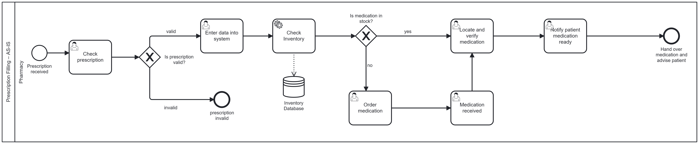
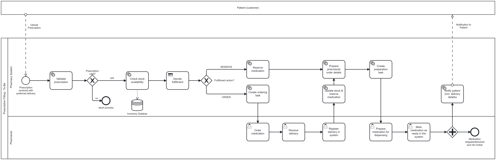
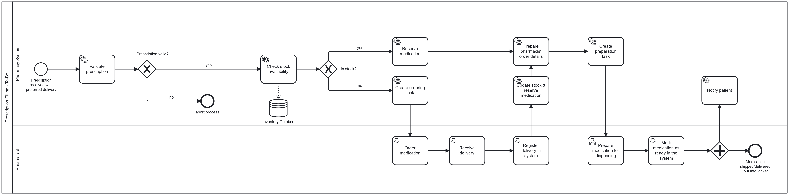

# AS25_Lotschberger

This study project digitizes and automates a pharmacy prescription workflow using **Camunda 7** and **Python External Task Workers**.
The main goal is automated prescription processing with a strong focus on **locker pickup**, enabling patients (customers) to collect their medication **outside pharmacy opening hours**.

Patients submit prescription data digitally (prototype). The system validates the input, checks stock availability, handles ordering if necessary, supports pharmacist preparation, and (planned) notifies the patient when the medication is ready in a locker.

## Academic Context

This project was developed as part of a university study project focusing on Business Process Management (BPM) and process automation.

The primary objective is to design, model, and technically implement a realistic TO-BE business process using Camunda BPMN and external microservices.
The project emphasizes process orchestration, automation logic, and system interaction, rather than production-ready software or a complete frontend solution.

## Authors

| **Name**             | **Email**                                                                             |
| -------------------- | ------------------------------------------------------------------------------------- |
| Feline Weger         | [feline.weger@students.fhnw.ch](mailto:feline.weger@students.fhnw.ch)                 |
| Lukas Kamber         | [lukas.kamber@students.fhnw.ch](mailto:lukas.kamber@students.fhnw.ch)                 |
| Semih Eryilmaz       | [semih.eryilmaz@students.fhnw.ch](mailto:semih.eryilmaz@students.fhnw.ch)             |
| Sivanajani Sivakumar | [sivanajani.sivakumar@students.fhnw.ch](mailto:sivanajani.sivakumar@students.fhnw.ch) |

## Supervisors

We would like to thank our supervisors for their guidance and support throughout this project.

| **Name**           | **Email**                                                       |
| ------------------ | --------------------------------------------------------------- |
| Andreas Martin     | [andreas.martin@fhnw.ch](mailto:andreas.martin@fhnw.ch)         |
| Charuta Pande      | [charuta.pande@fhnw.ch](mailto:charuta.pande@fhnw.ch)           |
| Devid Montecchiari | [devid.montecchiari@fhnw.ch](mailto:devid.montecchiari@fhnw.ch) |

---

## Table of Contents

* [Core Use Case: Locker Pickup](#core-use-case-locker-pickup)
* [AS-IS Process](#as-is-process)
    * [Roles](#roles)
    * [Workflow](#workflow)
    * [Limitations (AS-IS)](#limitations-as-is)
    * [Goal](#goal)
    * [User Stories](#user-stories)
* [TO-BE Process](#to-be-process)

    * [Key Features](#key-features)
    * [Camunda BPMN Workflow and Models](#camunda-bpmn-workflow-and-models)
    * [Focus on Locker Pickup](#focus-on-locker-pickup)
    * [TO-BE Workflow (Step-by-Step)](#to-be-workflow-step-by-step)
* [Microservices](#microservices)

    * [Service 1: Validation & Stock Check Worker](#service-1-validation--stock-check-worker)
    * [Service 2: Ordering Worker](#service-2-ordering-worker)
    * [Service 3: Pharmacist Preparation Worker](#service-3-pharmacist-preparation-worker)
* [Database](#database)
    * [Database Usage](#database-usage)
    * [Study Context](#study-context)

* [How Services Communicate (Process Variables)](#how-services-communicate-process-variables)
* [Run the Workflow](#run-the-workflow)
* [Limitations](#limitations)
* [Tools Used](#tools-used)
* [Usage of AI](#usage-of-ai)

---

## Core Use Case: Locker Pickup

The locker option is the primary delivery method in this project:

* Medication is prepared by the pharmacist.
* The medication is placed in a secure locker box.
* The patient receives locker details (via Make.com notification).
* The patient can pick up the medication **24/7**, even when the pharmacy is closed.

---

## AS-IS Process

The AS-IS process represents the current manual prescription workflow and is modeled as a BPMN diagram in Camunda.
[Figure 1](#figure-1-as-is) illustrates the AS-IS process model.  
The corresponding BPMN file can be found in the repository under  
[Prescription_Filing_AS_IS](./bpmn/Prescription_Filing_AS_IS.bpmn).

*Figure 1: AS-IS BPMN model of the current manual prescription process.*

### Roles

**External**

* Patient

**Internal**

* Pharmacist / Pharmacy staff

## Workflow

The current prescription process is largely manual:

1. The patient submits a prescription physically (or sometimes via email).
2. The pharmacist manually validates the prescription.
3. Stock availability is checked manually.
4. If the medication is not in stock, the pharmacist places a manual order and informs the patient that it will be available the next day (or later).
5. The patient then either:

   * returns to the pharmacy to pick it up during opening hours, or
   * waits for home delivery if shipping is arranged.

### Limitations (AS-IS)

* Manual coordination and manual status handling
* Pickup is typically tied to pharmacy opening hours, resulting in limited flexibility for patients
* No standardized locker pickup (no locker assignment, pickup code, or secure handover)

### Goal

Reduce manual effort, make processing traceable, and enable patients to receive or collect medication independently of pharmacy opening hours.

### User Stories

**User story 1 (Pharmacist):**
As a pharmacist, I want to process medication orders digitally and efficiently to avoid manual document handling. I want the system to automatically check stock availability and handle ordering when medication is out of stock, so that patients receive their medication as quickly as possible.

**Acceptance criteria**

* The system validates the prescription and checks medication stock automatically.
* The pharmacist approves or handles orders when medication is out of stock.
* The pharmacist marks medication as ready, triggering a patient-ready notification (planned).

**User Story 2 (Patient):**

As a patient, I want to receive a notification when my medication is ready and be able to collect it from a secure locker outside pharmacy opening hours,  
so that I can pick up my medication flexibly and without waiting.

**Acceptance criteria**
- The patient is informed when the medication is ready.
- If locker pickup is selected, the patient receives locker details and a pickup code.
- The medication can be collected independently of pharmacy opening hours.

---

## TO-BE Process

This chapter describes the redesigned and automated prescription handling process.
The TO-BE process reduces manual work, shortens waiting times, and provides a reproducible architecture using Camunda 7 and external Python workers.  

[Figure 2](#figure-2-to-be) illustrates the TO-BE process model.  
The corresponding BPMN file can be found in the repository under  
[Prescription_Filling_TO_BE](./bpmn/Prescription_Filling_TO_BE.bpmn).

*Figure 2: TO-BE BPMN model of the automated prescription process with locker-based pickup.*

### Key Features

The TO-BE process introduces several functional and technical improvements compared to the manual AS-IS workflow.
The following features summarize the core capabilities of the automated prescription process:

* **Digital prescription submission (prototype)**  
  Patients submit prescription data digitally, which triggers the start of the BPMN process.

* **Automated validation**  
  The system validates required fields, prescription date, quantity, and selected delivery option.

* **Stock check and ordering support**  
  If the medication is in stock, it is reserved automatically.  
  If it is not in stock, an ordering task is created and the process continues after delivery registration.

* **Multiple delivery options**  
  The process supports `locker`, `pickup`, and `home` delivery, selected via the `preferredDelivery` process variable.

* **Patient-ready notification (planned)**  
  Patient notification via **Make.com** is currently under implementation and therefore not yet included in this repository.

* **Structured data handling**  
  The use of process variables and a database layer ensures traceability and supports future system integrations.

### Camunda BPMN Workflow and Models

The AS-IS and TO-BE processes are orchestrated using **Camunda 7** and modeled as **BPMN workflows**.
Camunda serves as the central process engine and coordinates the interaction between system tasks, user tasks, and external microservices.

The BPMN models define the complete process logic, including the control flow, gateways, and task types:

- **System Tasks** are implemented as *External Service Tasks* and executed by Python workers.
- **User Tasks** represent manual pharmacist interactions, such as ordering medication, preparing prescriptions, and marking medication as ready.
- Process instances are started programmatically when prescription data is submitted and passed to Camunda as process variables.

Both BPMN models are included in this repository and represent the central artifacts of this project:

- **AS-IS BPMN model:**  
  Represents the current manual prescription handling process.  
  File: `./bpmn/Prescription_Filing_AS_IS.bpmn`  
  (see [Figure 1](#figure-1-as-is))

- **TO-BE BPMN model:**  
  Represents the redesigned and automated prescription process, including system tasks, user tasks, and gateways.  
  File: `./bpmn/Prescription_Filling_TO_BE.bpmn`  
  (see [Figure 2](#figure-2-to-be))

The BPMN diagrams shown in this README are direct visual representations of these models.
All process logic, gateways, and task types described in the text are derived from the BPMN definitions stored in the `bpmn` folder.

### Focus on Locker Pickup

While the process supports multiple delivery options, the **locker pickup scenario** represents the primary use case of this project.
It demonstrates how automated processes can enable secure, flexible, and time-independent medication pickup using BPMN-based orchestration.

### TO-BE Workflow (Step-by-Step)

This section describes the execution of the TO-BE process as defined in the BPMN model (see [Figure 2](#figure-2-to-be)) and the corresponding  
[BPMN file](./bpmn/Prescription_Filling_TO_BE.bpmn).

#### Process Start

The process starts when the patient submits prescription data via an external system (frontend, form, or API — prototype).
The submitted data is passed to Camunda as process variables, including the selected delivery option (`locker`, `pickup`, or `home`).

#### 1. Validate Prescription (System Task)

The system validates the prescription data, including required fields, quantity, prescription date, and delivery option.  
If the prescription is invalid, the process is terminated.

#### 2. Check Stock Availability (System Task)

The system checks medication availability using the inventory database and stores the result in the process variable `inStock` (boolean).

Immediately afterwards, a DMN decision table (`FulfillmentDecision`) is evaluated 
(see DMN model: [`diagram_2.dmn`](./bpmn/diagram_2.dmn)).
 
Based on `inStock`, it sets the process variable `action`:

- If `inStock = true`: `action = "RESERVE"`
- If `inStock = false`: `action = "ORDER"`

An exclusive BPMN gateway then routes the process according to `action`:

* If `action = "RESERVE"`, the process continues with reservation and preparation ([Step 3a](#3a-medication-available)).  
* If `action = "ORDER"`, an ordering task is created and the process continues after delivery registration ([Step 3b](#3b-medication-not-available)).

> Note: This decision could also be modeled directly as an XOR gateway.  
> The DMN was intentionally included for learning and demonstration purposes and to separate decision logic (DMN) from process flow (BPMN). 

#### 3a. Medication Available

If the medication is available, the process continues without manual intervention.  
First, a system task reserves the required medication quantity in the database.  
Next, additional system tasks prepare the pharmacist order details and create a preparation user task.  
This preparation task is then assigned to the pharmacist for manual execution ([Step 4](#4-prepare-medication-user-task)).

#### 3b. Medication Not Available

If the medication is not available, the process enters an ordering phase.
A system task creates an ordering user task for the pharmacist.  
The pharmacist orders the medication, receives the delivery, and registers the delivery in the system.  
After the delivery is registered, system tasks update the stock in the database and reserve the required medication quantity.  
The process then continues with preparation.

#### 4. Prepare Medication (User Task)

Based on the preparation task created by the system, the pharmacist prepares and packages the medication.
The preparation task contains a structured summary of the prescription, medication details, and the selected delivery method.

#### 5. Mark Medication as Ready (User Task)

Once preparation is completed, the pharmacist marks the medication as ready in the system.
This action triggers a parallel continuation of the process.

#### 6. Parallel Follow-up Actions (System Tasks — partially planned)

After the medication is marked as ready, the process continues in parallel system tasks.
One branch handles patient notification, while the other branch handles the selected delivery or pickup logistics.

**Patient notification:**  
Patient notification is via **Make.com**.  
Depending on the selected delivery option, the patient will receive:
- Locker pickup details, including locker ID and pickup code
- Pickup confirmation during pharmacy opening hours
- Home delivery status and delivery date

**Logistics handling (conceptual):**  
In parallel, the medication is either placed into a locker, prepared for in-store pickup, or handed over to a delivery service, depending on the selected delivery option.

---

## Microservices

All automated logic is implemented using Python External Task Workers.
Each worker listens to specific Camunda topics and completes tasks via the Camunda REST API.  

The microservices communicate only via Camunda process variables and can be executed independently (e.g., in Deepnote).

### Service 1: Validation & Stock Check Worker

This service is responsible for validating prescription data, checking medication availability, and reserving medication when sufficient stock is available at the beginning of the TO-BE process.

**Worker ID:** `python-worker-main`  
**Topics:** `validatePrescription`, `checkStock`, `reserveMedication`

**Responsibilities**

* Validate prescription data (mandatory fields, insurance number, date rules, quantity, delivery option)
* Check medication stock in the database
* Reserve medication if sufficient stock is available

**Key outputs (process variables)**

* `prescriptionValid`, `validationMessage`
* `inStock`, `availableQuantity`
* `reservationId`, `reservationSuccess`, `reservedMedicationName`, `reservedQuantity`

---

### Service 2: Ordering Worker

This service handles the ordering phase of the TO-BE process when medication is not available and ensures a seamless continuation of the process after restocking.

**Worker ID:** `python-worker-ordering`
**Topics:** `createOrderingTask`, `updateStockAndReserve`

**Responsibilities**

* Create an ordering task if medication is not in stock
* Generate a structured ordering description for the pharmacist
* Update stock after delivery registration and reserve medication

**Key outputs**

* `orderId`, `orderDescription`, `orderingTaskCreated`
- `reservationId`, `reservationMessage`, `reservationSuccess`

---

### Service 3: Pharmacist Preparation Worker

This service prepares all relevant information required for the pharmacist to perform the manual preparation step within the TO-BE process.

**Worker ID:** `python-worker-pharm`
**Topics:** `preparePharmacistOrder`, `createPreparationTask`

**Responsibilities**

* Create a compact pharmacist order summary
* Generate internal preparation instructions

**Key outputs**

* `pharmacistOrderId`, `pharmacistOrderSummary`
* `preparationTaskId`, `preparationInstructions`

---

## Database

The project includes a lightweight database layer to support medication stock management, reservations, and ordering within the TO-BE process.
The database is used by the Python external task workers and serves as a technical foundation for process automation.

[Figure 3](#figure-3-database) shows the database schema used in this project.

*Figure 3: Database schema for medication stock, reservations, and orders.*

### Database Usage

The database supports the following core functionalities:

- Checking and updating medication stock levels
- Creating and managing medication reservations
- Handling medication orders in out-of-stock scenarios (prototype)

### Study Context

In the context of this study project, the database is **minimally populated**.
The primary focus lies on **process automation, BPMN orchestration, and system interaction**, rather than on comprehensive data modeling or large-scale data persistence.

Nevertheless, the database schema reflects a realistic pharmacy setup and provides a solid foundation for future extensions.

---

## How Services Communicate (Process Variables)

The microservices in this project do not communicate directly with each other.
Instead, all data exchange is performed via **Camunda process variables**, which ensures loose coupling and clear separation between process orchestration and technical logic.

Process variables are used to transfer information between system tasks, user tasks, and external workers throughout the TO-BE process.

The most relevant process variables are grouped as follows:

**Process input variables (provided at process start):**
- `insuranceNumber`
- `medicationName`
- `quantity`
- `doctorName`
- `preferredDelivery`
- `prescriptionText`
- `datePrescribed`

**Validation variables:**
- `prescriptionValid`
- `validationMessage`

**Stock and availability variables:**
- `inStock`
- `availableQuantity`

**Reservation variables:**
- `reservationId`
- `reservationSuccess`
- `reservationMessage`

**Ordering variables:**
- `orderId`
- `orderDescription`

**Pharmacist preparation variables:**
- `pharmacistOrderSummary`
- `preparationInstructions`

---

## Run the Workflow

1. Start the **Camunda 7 engine**.
2. Start the Python workers (e.g., in Deepnote):

   * `python-worker-main`
   * `python-worker-ordering`
   * `python-worker-pharm`
3. Start the process instance in Camunda with initial variables (currently manual start; frontend trigger planned).
4. Complete pharmacist user tasks in the Camunda Tasklist.
5. Observe automatic progression of system tasks.

---

## Limitations

* Patient upload frontend is not part of this implementation (process start is manual or API-based).
* Locker hardware integration is conceptual.
* Database content is minimal and intended for demonstration purposes.

---

## Tools Used

* Camunda 7 (BPMN, External Tasks)
* [Deepnote Python 3.9](https://deepnote.com/workspace/digitalization-in-business-processes-fdb77daf-844d-4688-b685-2e79b038f73c/project/Pharmacy-Prescription-Filling-9e724985-6ac4-47d7-8cf8-ff0d5f4d03cb?utm_content=9e724985-6ac4-47d7-8cf8-ff0d5f4d03cb)
* REST APIs
* Make.com 
* ChatGPT (AI-assisted coding and documentation support)
* DeepL (language refinement)

---

## Usage of AI

Artificial intelligence tools were used as supportive aids during the development of this project.
In particular, **ChatGPT** and **DeepL** were used to assist with coding, text formulation, language refinement, and conceptual clarification.

All architectural decisions, BPMN models, process logic, and implementations were designed and validated by the project team.
The use of AI served as a productivity and quality support tool and does not replace the team’s own work.