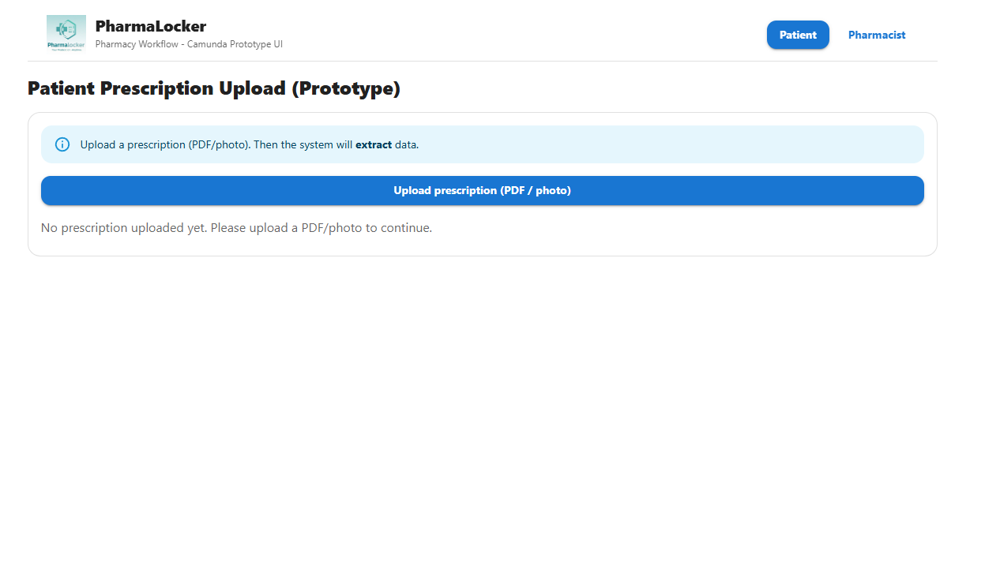
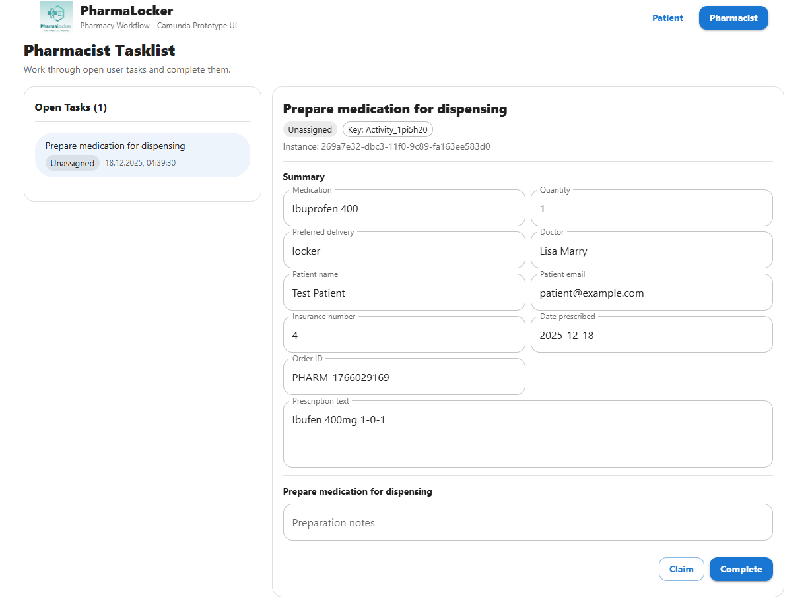

# Pharmacy Frontend Prototype (React)

This repository contains a **React-based frontend prototype** developed to demonstrate
the user interaction with the automated pharmacy prescription process.

The frontend is intentionally kept simple and focuses on illustrating the
process flow rather than providing a production-ready application.

---

## Overview

For this prototype, a **single web application** is used to demonstrate two perspectives:

* **Patient interface**
* **Pharmacist interface**

In a real-world setup, these would be implemented as **two separate systems**:

* Patients would access the system via a public website or patient portal
  to upload prescriptions and manage their account.
* Pharmacies would use an internal system installed on pharmacy workstations
  to process prescriptions and manage medication dispensing.

For demonstration purposes, both views are combined into one prototype application.

---

## File Upload and Mock Data Handling

Patients can upload any type of file (e.g. PDF or image) via the upload interface.

However, no real data is extracted from the uploaded file.
Instead, mock data is automatically generated and submitted to the process.

This design decision was made intentionally to:

* keep the prototype lightweight,
* focus on a user-centric process flow rather than document processing,
* illustrate how a patient-facing upload experience would look in a real system.

The upload functionality therefore serves only as a visual and interaction mock to demonstrate the starting point of the process.

---

## Project Structure

* `Patient Upload Page`
  Allows patients to upload a prescription and review extracted data before
  starting the process.

* `Pharmacist Task View`
  Displays Camunda user tasks for pharmacists, such as:

  * preparing medication,
  * marking medication as ready,
  * handling different delivery options (locker, pickup, home delivery).

---

## Running the Frontend

### Prerequisites

* npm

### Start the application

```bash
cd pharmacy-ui
npm install
npm run dev
```

The application will be available at:

```
http://localhost:5173
```

---

## Screenshots

### Patient Interface

The patient interface allows users to upload a prescription and submit
the extracted information to start the process.



---

### Pharmacist Interface

The pharmacist interface displays active Camunda user tasks and allows
pharmacists to complete tasks related to medication preparation and delivery.



---

## Authentication (Out of Scope)

Authentication and authorization are **not implemented** in this prototype.

In a real-world system, the following would be required:

* Patient login and identity management
* Secure pharmacist authentication
* Role-based access control

Authentication is considered a **future extension** and intentionally excluded
to keep the focus on process orchestration and system integration.

---

## Scope and Limitations

* This frontend is a **prototype** for academic demonstration purposes.
* Uploaded files are not processed or analyzed.
* All patient and prescription data is mocked.
* No persistent user accounts are stored.
* No real medical or personal data is processed.
* The focus is on illustrating:

  * BPMN-based orchestration (Camunda),
  * user task handling,
  * and external system integration.

---

## Summary

The frontend prototype demonstrates how patients and pharmacists interact
with the automated prescription workflow. While simplified, it provides
a realistic impression of how such a system could be integrated into
existing healthcare and pharmacy environments.
